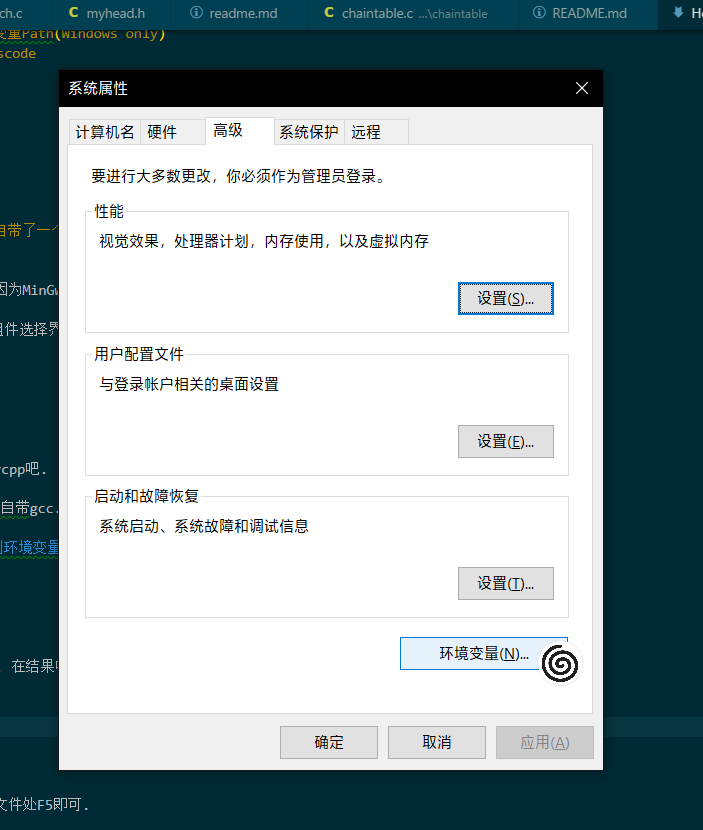
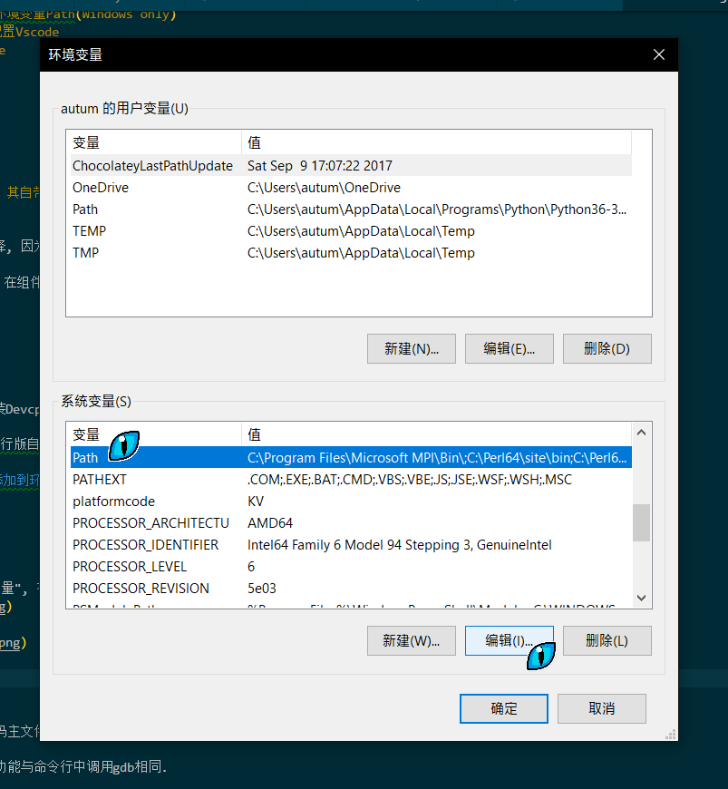
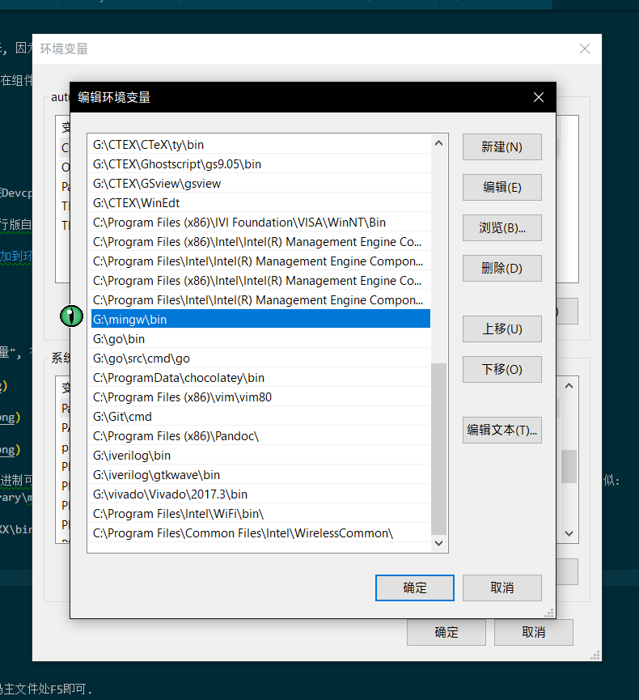
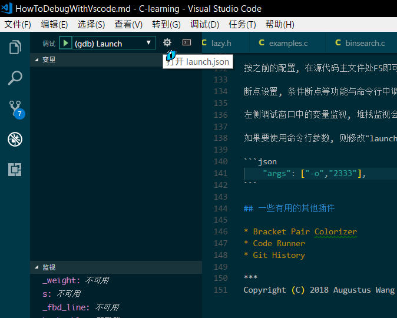

# Vscode 调试功能使用(C语言)不完全指北

Copyright (C) 2018 Augustus Wang

***

## 引言

如果能用VS的话去用VS, 没必要在这折腾.

如果你用的是Windows, 觉得Devcpp的审美不是很辣眼睛的话, 使用Devcpp, 不要在这折腾.

如果在用Linux, 只使用Bash下的gcc, gdb的话, 试试CodeBlocks, 它一样是开箱即用的IDE, 而且不用折腾.

如果你仍然坚持的话......

预计整个安装过程需要不少于15min, Linux下可能会更简单一些.

更详细的使用方法, 请自己去看VScode的官方文档.

https://code.visualstudio.com/docs#vscode

## 调试功能安装

### 总体步骤:

1. 安装vscode
1. Ctrl+Shift+X(进入插件管理) 搜索扩展"C/C++"并安装
1. 安装gcc, gdb(Windows only)
1. 将gcc, gdb添加到环境变量Path(Windows only)
1. 选择项目文件夹, 配置Vscode
1. Compile and Debug with vscode

### 各步骤详解

#### 3. 安装gcc

Windows: 有两种选择

1. 下载并安装Devcpp, 其自带了一个gcc库
2. 下载并安装MinGw

这里建议使用第一种选择, 因为MinGw的下载速度实在不敢恭维(你自己去找镜像当我没说).

若是下载并安装MinGw, 在组件选择界面请选择Basic Setup选项卡, 至少选中以下组件:

* mingw32-base
* mingw32-gcc-g++

然后进行下载安装.

因为太麻烦了所以还是装Devcpp吧.

Linux: 常见的Linux发行版自带gcc.

#### 4. 将gcc, gdb添加到环境变量Path

以Windows10系统为例.

按
    Win+Q 
激活查找, 输入"环境变量", 在结果中选择"编辑系统环境变量", 如图:






单击"新建", 将gcc的二进制可执行文件目录添加到Path变量. 注意: 可执行文件目录在之前安装的Devcpp/MinGw的安装目录下, 目录名类似:
    G:\anaconda\Library\mingw-w64\bin

关键词在于"\mingw-XXXX\bin"

完成效果图:



保存并退出.

#### 5. 配置Vscode

VScode是以文件夹的形式来组织工程的, 你对当前工程的设置保存在当前文件夹下的".vscode"文件夹.

首先, 使用VScode打开一个文件夹(Ctrl+K+O), 注意, 此后的所有保存的代码, 进行的操作均在此文件夹下.

将附件中的".vscode"文件夹粘贴到此文件夹下.

打开"launch.json", 将

    "miDebuggerPath": "G:/mingw/bin/gdb.exe",

中的路径改成gdb.exe的位置, 其就在你之前设置的环境变量中的文件夹里.

注意这里反斜线的方向.


```json
{
    "version": "0.2.0",
    "configurations": [

        {
            "name": "(gdb) Launch",
            "type": "cppdbg",
            "request": "launch",
            "program": "${file}.exe",
            "args": [],
            "stopAtEntry": false,
            "cwd": "${workspaceRoot}",
            "environment": [],
            "externalConsole": true,
            "MIMode": "gdb",
            "miDebuggerPath": "G:/mingw/bin/gdb.exe",    //修改成你的gdb.exe的位置
            "preLaunchTask": "gcc",
            "setupCommands": [
                {
                    "description": "Enable pretty-printing for gdb",
                    "text": "-enable-pretty-printing",
                    "ignoreFailures": true
                }
            ]
        }
    ]
}
```

重启VScode(确保$Path改动生效)

如果没出什么偏差的话, 打开源代码主文件, 按F5就可以正常调试了.

## 如何使用调试功能

按之前的配置, 在源代码主文件处F5即可.

断点设置, 条件断点等功能与命令行中调用gdb相同.

左侧调试窗口中的变量监视, 堆栈监视会为调试带来极大的方便.

如果要使用命令行参数, 则修改"launch.json"中的 "args": [], 例如:

```json
    "args": ["-o","2333"],
```

在调试面板中可以快速修改调试选项"launch.json", 如图中位置所示:



## 一些有用的其他插件

* Bracket Pair Colorizer
* Code Runner
* Git History

## 附件

launch.json

```json
{
    "version": "0.2.0",
    "configurations": [

        {
            "name": "(gdb) Launch",
            "type": "cppdbg",
            "request": "launch",
            "program": "${file}.exe",
            "args": [],
            "stopAtEntry": false,
            "cwd": "${workspaceRoot}",
            "environment": [],
            "externalConsole": true,
            "MIMode": "gdb",
            "miDebuggerPath": "G:/mingw/bin/gdb.exe",    //修改成你的gdb.exe的位置
            "preLaunchTask": "gcc",
            "setupCommands": [
                {
                    "description": "Enable pretty-printing for gdb",
                    "text": "-enable-pretty-printing",
                    "ignoreFailures": true
                }
            ]
        }
    ]
}
```

tasks.json

```json
{
    "version": "0.1.0",
    "command": "gcc",
    "args": ["-g","${file}","-o","${file}.exe"],    // 编译命令参数
    "problemMatcher": {
        "owner": "c",
        "fileLocation": ["relative", "${workspaceRoot}"],
        "pattern": {
            "regexp": "^(.*):(\\d+):(\\d+):\\s+(warning|error):\\s+(.*)$",
            "file": 1,
            "line": 2,
            "column": 3,
            "severity": 4,
            "message": 5
        }
    }
}
```

***
Copyright (C) 2018 Augustus Wang
